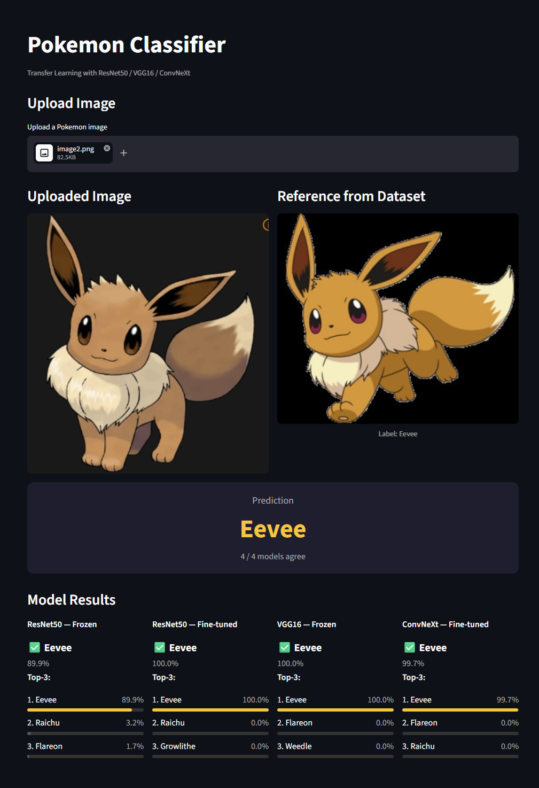
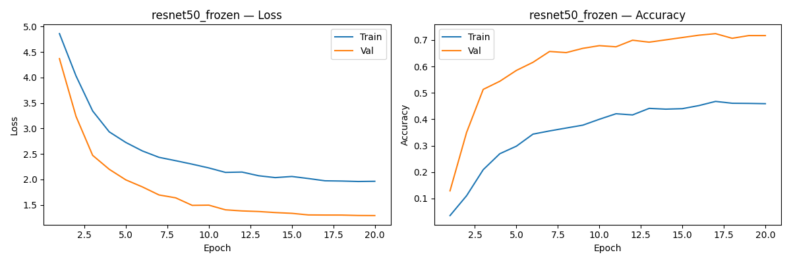
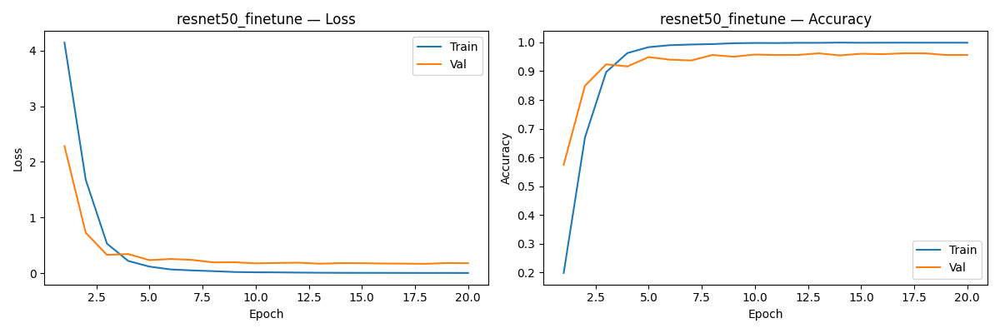
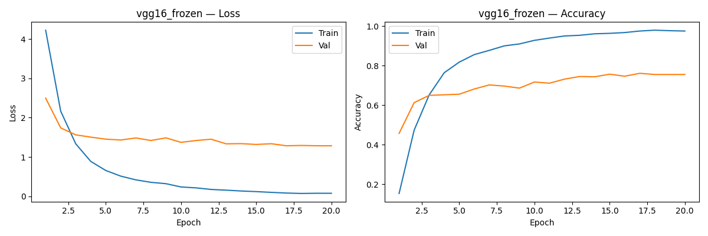
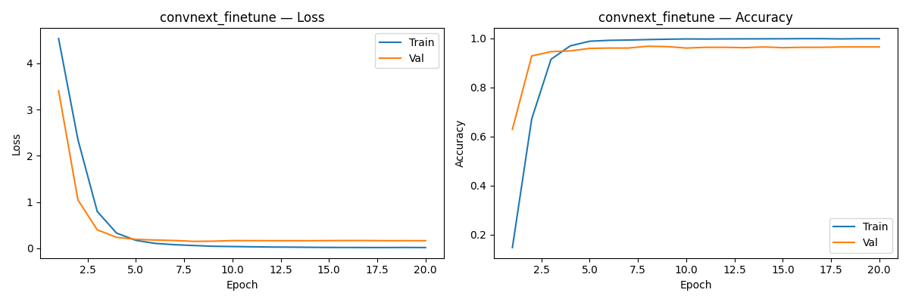

# TLPC — Transfer Learning Pokemon Classifier

A Pokemon image classifier using transfer learning with 4 experimental configurations. Upload a Pokemon image and get predictions from multiple models with majority voting.

---

## Demo



---
## Features

- **4 Model Experiments** — ResNet50 (frozen / fine-tuned), VGG16 (frozen), ConvNeXt (fine-tuned)
- **Majority Voting** — Final prediction determined by consensus across all models
- **Per-model Top-3** — Confidence breakdown for each model
- **Reference Image** — Shows a matching dataset image alongside the prediction
- **Demo GUI** — Interactive web interface built with Streamlit

---

## Requirements

```
python >= 3.8
torch
torchvision
streamlit
scikit-learn
matplotlib
Pillow
```

Install dependencies:
```bash
pip install torch torchvision streamlit scikit-learn matplotlib Pillow
```

---

## Usage

### 1. Prepare Dataset

Download the [7,000 Labeled Pokemon dataset](https://www.kaggle.com/datasets/lantian773030/pokemonclassification) from Kaggle and place it as:

```
PokemonData/
├── Bulbasaur/
├── Ivysaur/
└── ...
```

### 2. Train Models

```bash
python train.py
```

Trains all 4 experiments sequentially. Checkpoints are saved to `checkpoints/` and learning curves to `results/`.

### 3. Run Demo GUI

```bash
streamlit run TLPC.py
```

---

## Experiments

| # | Model | Strategy | LR |
|---|-------|----------|----|
| 1 | ResNet50 | Pretrained, FC only (backbone frozen) | 1e-3 |
| 2 | ResNet50 | Pretrained, Full fine-tuning | 1e-4 |
| 3 | VGG16 | Pretrained, FC only (backbone frozen) | 1e-3 |
| 4 | ConvNeXt-Tiny | Pretrained, Full fine-tuning | 1e-4 |

### FC Head Architecture

| Model | FC Structure |
|-------|-------------|
| ResNet50 | 2048 → 512 → ReLU → Dropout(0.5) → 150 |
| VGG16 | 25088 → 512 → ReLU → Dropout(0.5) → 150 |
| ConvNeXt | 768 → 256 → ReLU → Dropout(0.5) → 150 |

---

## Results

| Model | Val Acc | Test Acc | Precision | Recall |
|-------|---------|----------|-----------|--------|
| ResNet50 — Frozen | 0.7243 | 0.7097 | 0.7277 | 0.7217 |
| ResNet50 — Fine-tuned | 0.9619 | 0.9589 | 0.9553 | 0.9521 |
| VGG16 — Frozen | 0.7610 | 0.7610 | 0.7491 | 0.7552 |
| **ConvNeXt — Fine-tuned** | **0.9677** | **0.9663** | **0.9642** | **0.9598** |

### Key Findings

- **Fine-tuning vs Frozen**: Comparing ResNet50 frozen(0.71) vs fine-tuned(0.96) shows a ~25%p gap. ImageNet features alone are insufficient for cartoon-style Pokemon images.
- **ConvNeXt best**: The combination of a modern architecture and full fine-tuning yields the strongest performance.
- **VGG16 > ResNet50 (frozen)**: VGG16's larger FC structure makes better use of frozen features than ResNet50.

### Learning Curves

| ResNet50 Frozen | ResNet50 Fine-tuned |
|-----------------|---------------------|
|  |  |

| VGG16 Frozen | ConvNeXt Fine-tuned |
|--------------|---------------------|
|  |  |

---

## Known Issues

**GUI layout breaks on wide/ultrawide monitors**

The Streamlit two-column layout does not scale well on very wide displays (e.g. ultrawide monitors), causing image proportions to break. This is a known limitation of Streamlit's column layout system.

---

## File Structure

```
TLPC/
├── TLPC.py              # Streamlit GUI
├── models.py            # Model definitions & experiment configs
├── train.py             # Training script
├── PokemonData/         # Dataset (not included)
├── checkpoints/
│   ├── resnet50_frozen_best.pth
│   ├── resnet50_finetune_best.pth
│   ├── vgg16_frozen_best.pth
│   └── convnext_finetune_best.pth
├── results/
│   ├── resnet50_frozen_curve.png
│   ├── resnet50_finetune_curve.png
│   ├── vgg16_frozen_curve.png
│   ├── convnext_finetune_curve.png
│   └── results.json
└── README.md
```